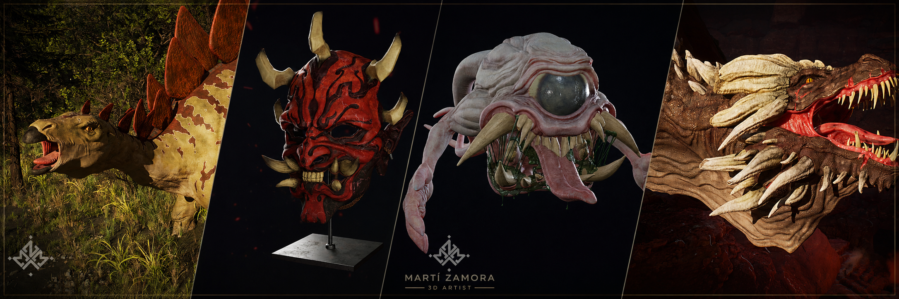

# Hola, soy Martí Zamora i Merino 👋

### Artista 3D · Desarrollo interactivo · Docencia y mentoría

**Creatividad para imaginar. Técnica para construir. Experiencia para acompañar.**

Conecto el arte digital, los videojuegos y la formación a través de proyectos, personas y conocimiento compartido.

**Arte y producción 3D** &nbsp; / &nbsp; **Videojuegos y VR** &nbsp; / &nbsp; **Coordinación y formación**

<!-- Opcional: añade aquí una imagen panorámica propia con una selección de tus trabajos.
Guárdala en assets/banner-portfolio.jpg y utiliza:
-->

---

## 🎯 Sobre mí

Soy **artista 3D, docente y mentor de proyectos**, con experiencia en producción digital, programación y coordinación del área tecnológica. Mi trayectoria combina el trabajo creativo y técnico con la organización de programas formativos y el acompañamiento de nuevos profesionales.

Mi especialidad es el **modelado, la escultura digital y la creación de assets para entornos en tiempo real**. Trabajo con una visión que conecta la intención artística con las necesidades de producción: cómo se construye un recurso, cómo se integra y qué aporta a la experiencia final.

Desde 2019 desarrollo mi trayectoria docente en formación profesional, a la que he sumado formación de postgrado, responsabilidades de coordinación e intercambios internacionales. En paralelo, mi actividad en **ViOD Games Studio** me permite vincular la creación de contenidos 3D con proyectos de *serious games* y mentoría.

Me interesan los proyectos en los que distintas disciplinas se necesitan entre sí: **arte, programación, diseño, tecnología y aprendizaje**. Disfruto creando, resolviendo problemas y ayudando a que un equipo o una idea encuentren su siguiente paso.

## 🧭 Qué puedo aportar

<table>
<tr>
<td width="50%" valign="top">
<h3>🎨 Arte 3D y producción visual</h3>

Creación de personajes, objetos y recursos para proyectos digitales, atendiendo tanto a su identidad visual como a sus necesidades técnicas.

<ul>
<li>Modelado y escultura digital.</li>
<li>Retopología, texturas y materiales.</li>
<li>Concept art y desarrollo visual.</li>
<li>Render y postproducción.</li>
</ul>
</td>
<td width="50%" valign="top">
<h3>🎮 Videojuegos y experiencias interactivas</h3>

Una mirada que conecta la producción artística con la lógica de las experiencias en tiempo real.

<ul>
<li>Assets para Unity y Unreal Engine.</li>
<li>Participación en proyectos de serious games.</li>
<li>Proyectos formativos de realidad virtual.</li>
<li>Programación en Java y JavaScript en el ámbito docente.</li>
</ul>
</td>
</tr>
<tr>
<td width="50%" valign="top">
<h3>🧩 Coordinación y planificación</h3>

Experiencia organizando formación tecnológica y conectando especialidades, necesidades y equipos docentes.

<ul>
<li>Coordinación de ciclos de FP y postgrado.</li>
<li>Planificación de programas y contenidos.</li>
<li>Revisión y mejora curricular.</li>
<li>Conexión entre formación y práctica profesional.</li>
</ul>
</td>
<td width="50%" valign="top">
<h3>🎓 Docencia y mentoría</h3>

Acompañamiento centrado en el criterio propio, la autonomía y la capacidad de llevar un proyecto adelante.

<ul>
<li>Formación profesional y especialización en arte 3D.</li>
<li>Aprendizaje basado en proyectos.</li>
<li>Orientación en decisiones creativas y técnicas.</li>
<li>Talleres e intercambio de metodologías.</li>
</ul>
</td>
</tr>
</table>

## 💼 Trayectoria profesional

### ViOD Games Studio · Artista 3D y mentor de proyectos

**Diciembre de 2025 – actualidad**

Participo en proyectos de *serious games*, creando assets 3D de objetos y personajes para flujos de trabajo en tiempo real con **Unity y Unreal Engine**. Compagino la producción artística con la mentoría de estudiantes, acompañándolos en la toma de decisiones y en el desarrollo de los proyectos.

Esta combinación me permite trabajar sobre necesidades de producción y, al mismo tiempo, ayudar a otros perfiles a comprender el proceso y asumir responsabilidades dentro de él.

### Escola Pia · Profesor de formación profesional y postgrado

**Escola Pia Mataró · Desde septiembre de 2025**  
**Escola Pia Nostra Senyora · 2019–2026**

He impartido contenidos en **Animación 3D, Juegos y Entornos Interactivos; Desarrollo de Aplicaciones Multiplataforma; Desarrollo de Aplicaciones Web; Sistemas Microinformáticos y Redes**, y en el **postgrado de Técnicas Avanzadas de Arte 3D**.

Mi experiencia abarca modelado y texturizado, concept art, diseño gráfico, diseño de juegos, programación estructurada, JavaScript, realidad virtual, ofimática, servicios en red y trabajo por proyectos.

### Escola Pia Nostra Senyora · Coordinador del área tecnológica

**2021–2026**

He asumido la gestión y planificación del área tecnológica, conectando los ciclos de **SMX, DAM y A3D** con la formación de postgrado en arte 3D. Esta responsabilidad me ha aportado experiencia para organizar programas, coordinar necesidades y mantener una visión global de la formación.

---

## 🚀 Tecnologías y herramientas

### Modelado y escultura digital

Modelado de personajes y objetos · Escultura digital · Retopología · Preparación de assets.

### Texturas, diseño e ilustración

Texturizado y materiales · Concept art · Diseño gráfico · Ilustración digital y tradicional.

### Motores y programación

Producción en tiempo real · Serious games · Proyectos de realidad virtual · Enseñanza de programación.

## 🖼️ Proyectos y portfolio

Mi portfolio reúne trabajos que reflejan mi formación artística y mi interés por construir personajes y entornos con identidad propia.

| Proyecto | Contexto | Enlace |
| --- | --- | --- |
| **Rhaegor, The Rock Fury** | Proyecto final del Máster en Arte 3D, Animación y Efectos Visuales para Cinema y Videojuegos. | [Ver proyecto →](https://www.artstation.com/artwork/29zD4J) |
| **La casa japonesa en tiempos de Edo y el Ukiyo-e** | Proyecto final del Grado en Diseño y Producción de Videojuegos. | [Ver proyecto →](https://www.artstation.com/artwork/lxm1EV) |
| **Portfolio de arte 3D** | Selección de trabajos y proyectos artísticos. | [Explorar ArtStation →](https://www.artstation.com/mzamoramerino) · [TheRookies →](https://www.therookies.co/u/mzamoramerino) |

<!-- Para convertir esta sección en una galería, añade renders propios al repositorio.
Ejemplos de imágenes enlazadas; activa estas líneas cuando existan los archivos:

-->

## 🌍 Experiencia internacional

Conocer otras formas de enseñar y trabajar me ha permitido revisar mis propios métodos y ampliar mi visión de las profesiones creativas y tecnológicas.

| Año | Destino e institución | Experiencia |
| --- | --- | --- |
| **2025** | 🇵🇪 **Lima, Perú · SENATI** | Docente internacional invitado: ponencia sobre animación y arte 3D, taller para profesorado sobre tecnología, IA y metodologías educativas, y colaboración en revisión curricular. |
| **2025** | 🇪🇪 **Tartu, Estonia · Tartu Rakenduslik Kolledž** | Movilidad docente con la Fundació Barcelona FP para intercambiar metodologías y enfoques prácticos de formación profesional. |
| **2024** | 🇵🇱 **Wrocław, Polonia · Uniwersytet Dolnośląski DSW** | Job shadowing Erasmus+ con docentes y estudiantes de arte 3D, efectos visuales y programación. |
| **2022** | 🇮🇪 **Cork, Irlanda · Cork College of FET** | Observación docente e intercambio sobre metodologías y sistemas educativos. |

---

## 📚 Formación y conocimiento compartido

### Mi manera de entender el aprendizaje

Para mí, formar profesionales significa ayudarles a **comprender, decidir y actuar con autonomía**. Una herramienta cambia; la capacidad de analizar un problema, buscar información y justificar una solución sigue siendo útil.

Por eso doy especial importancia a:

- **Aprender haciendo:** relacionar los contenidos con proyectos y situaciones concretas.
- **Construir sobre las bases:** recuperar conocimientos previos y conectarlos con nuevos retos.
- **Desarrollar criterio:** entender por qué una solución funciona y cuándo conviene revisarla.
- **Trabajar con iniciativa:** investigar, probar, documentar y aprender de los errores.
- **Colaborar con responsabilidad:** comunicar decisiones y cuidar el trabajo compartido.

### El propósito de este GitHub

Quiero que este espacio conecte mi actividad profesional con mi trabajo docente: un lugar para documentar procesos, compartir recursos y hacer visible cómo se construyen los proyectos.

Las líneas de contenido que quiero desarrollar aquí son:

| Línea | Enfoque |
| --- | --- |
| **Programación** | Fundamentos, ejercicios y proyectos para desarrollar el razonamiento y la resolución de problemas. |
| **Desarrollo web** | JavaScript y construcción de experiencias interactivas. |
| **Unity y realidad virtual** | Proyectos guiados que conecten programación, interacción y creación de entornos. |
| **Arte 3D y videojuegos** | Procesos de producción, recursos y documentación de decisiones artísticas y técnicas. |
| **Sistemas y redes** | Guías prácticas y documentación de entornos de trabajo en el contexto de la FP. |

<!-- Cuando dispongas de las URL definitivas, enlaza aquí tus repositorios destacados.
Formato: [Nombre del repositorio](URL) — Una frase que explique su utilidad.
No se incluyen enlaces provisionales para evitar destinos rotos.
-->

## 🎓 Formación académica

- **Máster en Formación del Profesorado de ESO, Bachillerato, FP y Enseñanza de Idiomas**  
  Blanquerna · La Salle · Universitat Ramon Llull · **2024–2025**.
- **Máster en Arte 3D, Animación y Efectos Visuales para Cinema y Videojuegos**  
  CEV · Escuela Superior de Comunicación, Imagen y Sonido · **2022–2023**.
- **Grado en Diseño y Producción de Videojuegos**  
  TecnoCampus · Universitat Pompeu Fabra · **2016–2021**.

**Idiomas:** catalán y castellano nativos · inglés con nivel equivalente a B2.

## ✨ Más allá del trabajo

El arte, la cultura y los viajes alimentan mi curiosidad y mi manera de observar. Disfruto de la ilustración tradicional, el cine, las series y el deporte. Estas aficiones también forman parte de mi mirada creativa: me acercan a otras historias, referencias y maneras de representar el mundo.

## 🤝 ¿Colaboramos?

Me interesa conectar con profesionales, estudios, centros educativos y equipos que necesiten combinar **creatividad, conocimiento técnico y capacidad de acompañamiento**.

Podemos hablar de:

- **Producción artística:** modelado, escultura digital y assets 3D para proyectos interactivos.
- **Videojuegos y serious games:** colaboración artística y conexión entre producción y formación.
- **Formación y talleres:** arte 3D, videojuegos y aprendizaje basado en proyectos.
- **Mentoría:** acompañamiento de estudiantes y orientación de proyectos creativos y tecnológicos.
- **Iniciativas educativas:** intercambio de materiales, metodologías y experiencias profesionales.

Si quieres proponer una mejora a un repositorio, puedes abrir una *issue* o enviar una *pull request* cuando las contribuciones estén habilitadas. Para encargos, formación o propuestas profesionales, puedes escribirme directamente.

### Hablemos de tu próximo proyecto

[**✉️ Correo electrónico**](mailto:mzamoramerino@gmail.com) &nbsp; · &nbsp; [**💼 LinkedIn**](https://www.linkedin.com/in/mart%C3%AD-zamora-merino-16051998) &nbsp; · &nbsp; [**🎨 ArtStation**](https://www.artstation.com/mzamoramerino) &nbsp; · &nbsp; [**⭐ TheRookies**](https://www.therookies.co/u/mzamoramerino)

**Crear con intención. Compartir con criterio. Seguir aprendiendo.**

Gracias por visitar mi perfil.

